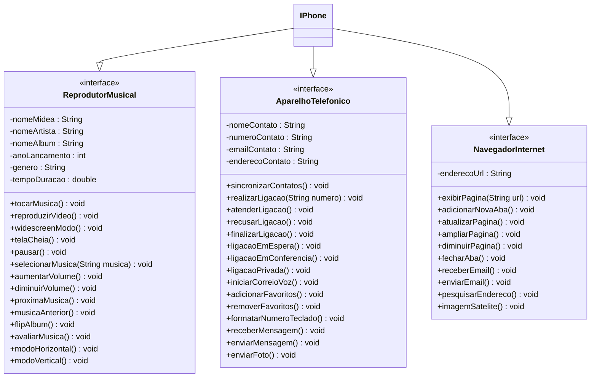

# 📱 Projeto: Modelagem e Diagramação de um Componente iPhone

## 🧾 Descrição

Este repositório contém a modelagem e diagramação UML de um componente **iPhone**, com base em seu lançamento oficial apresentado por Steve Jobs em 2007. O desafio foi proposto pela [DIO.me](https://www.dio.me/) com o objetivo de aplicar conceitos fundamentais de **Orientação a Objetos** por meio da **criação de interfaces, classes e diagramação UML**.

O projeto representa o iPhone como um dispositivo multifuncional, com três funcionalidades principais:
- **Reprodutor Musical**
- **Aparelho Telefônico**
- **Navegador na Internet**

## 🎯 Objetivo

- Modelar interfaces para representar cada uma das funcionalidades descritas.
- Criar uma classe `IPhone` que implementa essas funcionalidades.
- Representar a estrutura do sistema utilizando **diagrama de classes UML**.
- (Opcional) Implementar o código Java correspondente às interfaces e à classe `IPhone`.

## üß© Principais Funcionalidades Modeladas

### üéµ Reprodutor Musical
- `tocar()`
- `pausar()`
- `selecionarMusica(String musica)`

### 📞 Aparelho Telefônico
- `ligar(String numero)`
- `atender()`
- `iniciarCorreioVoz()`

### üåê Navegador na Internet
- `exibirPagina(String url)`
- `adicionarNovaAba()`
- `atualizarPagina()`

## 📽️ Referência

- **Vídeo do Lançamento do iPhone - 2007**
  - Link: [YouTube - Apple iPhone Launch](https://www.youtube.com/watch?v=9ou608QQRq8&ab_channel=TuchilaRino)
  - Trecho relevante: de **00:15 até 00:55**

## 🛠️ Ferramentas Utilizadas

- **Linguagem**: Java
- **Modelagem UML**: [Mermaid](https://mermaid.js.org/) ou ferramenta UML de sua preferência (StarUML, Lucidchart, etc.)
- **IDE recomendada**: IntelliJ IDEA / Eclipse / VS Code com suporte a Java

## 🗂️ UML | Diagrama de Classe em Mermaid

```mermaid
classDiagram
    class ReprodutorMusical {
        <<interface>>
        -nomeMidea : String
        -nomeArtista : String
        -nomeAlbum : String
        -anoLancamento : int
        -genero : String
        -tempoDuracao : double

        %% +String getNomeMusica()
        %% +void setNomeMusica(String nomeMusica)
        %% +String getnomeArtista()
        %% +void setnomeArtista(String artista)
        %% +String getNomeAlbum()
        %% +void setNomeAlbum(String nomeAlbum)
        %% +int getAnoLancamento()
        %% +void setAnoLancamento(int anoLancamento)
        %% +String getGenero()
        %% +void setGenero(String genero)
        %% +double getTempoDuracao()
        %% +void setTempoDuracao(double tempoDuracao)

        +tocarMusica() void
        +reproduzirVideo() void
        +widescreenModo() void
        +telaCheia() void
        +pausar() void
        +selecionarMusica(String musica) void
        +aumentarVolume() void
        +diminuirVolume() void
        +proximaMusica() void
        +musicaAnterior() void
        +flipAlbum() void
        +avaliarMusica() void
        +modoHorizontal() void
        +modoVertical() void
    }

    class AparelhoTelefonico {
        <<interface>>
        %% Contato
        -nomeContato : String
        -numeroContato : String
        -emailContato : String
        -enderecoContato : String

        %% Ligações
        +sincronizarContatos() void
        +realizarLigacao(String numero) void
        +atenderLigacao() void
        +recusarLigacao() void
        +finalizarLigacao() void
        +ligacaoEmEspera() void
        +ligacaoEmConferencia() void
        +ligacaoPrivada() void
        +iniciarCorreioVoz() void
        +adicionarFavoritos() void
        +removerFavoritos() void
        +formatarNumeroTeclado() void

        %% SMS
        +receberMensagem() void
        +enviarMensagem() void

        %% Fotos
        +enviarFoto() void
    }

    class NavegadorInternet {
        <<interface>>
        %% Web Browser
        -enderecoUrl : String

        +exibirPagina(String url) void
        +adicionarNovaAba() void
        +atualizarPagina() void
        +ampliarPagina() void
        +diminuirPagina() void
        +fecharAba() void

        %% Emails
        +receberEmail() void
        +enviarEmail() void

        %% Google Maps
        +pesquisarEndereco() void
        +imagemSatelite() void
    }

    class IPhone {

    }

    IPhone --|> ReprodutorMusical
    IPhone --|> AparelhoTelefonico
    IPhone --|> NavegadorInternet
```