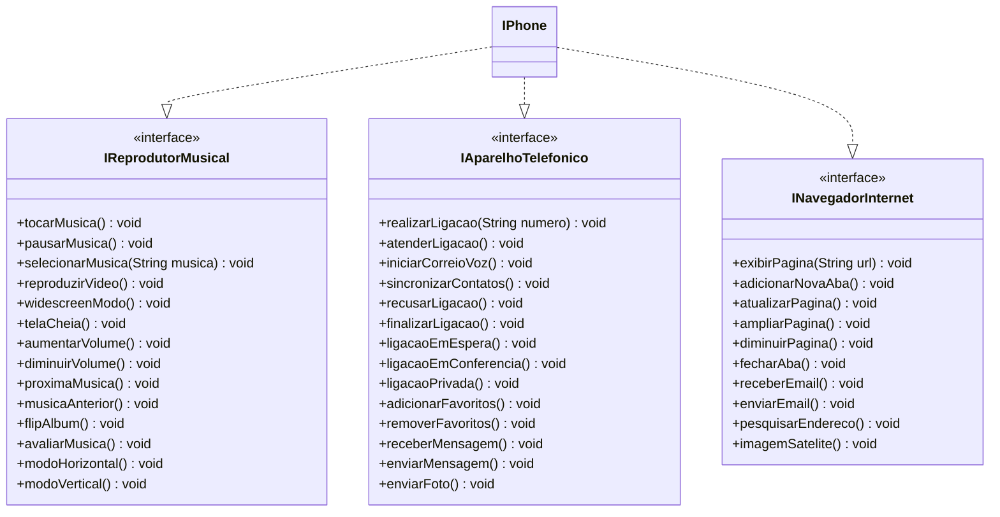

# Desafio: Modelagem e Diagramação de um Componente iPhone

## Descrição

Este repositório contém a modelagem e diagramação UML de um componente **iPhone**, com base em seu lançamento oficial apresentado por Steve Jobs em 2007. O desafio foi proposto pela <a href="https://www.dio.me/" target="_blank">DIO.me</a> com o objetivo de aplicar conceitos fundamentais de **Orientação a Objetos** por meio da **criação de interfaces, classes e diagramação UML**.

O projeto representa o iPhone como um dispositivo multifuncional, com três funcionalidades principais:
- **Reprodutor Musical**
- **Aparelho Telefônico**
- **Navegador na Internet**

## Objetivo

- Modelar interfaces para representar cada uma das funcionalidades descritas.
- Criar uma classe `IPhone` que implementa essas funcionalidades.
- Representar a estrutura do sistema utilizando **diagrama de classes UML**.
- (Opcional) Implementar o código Java correspondente às interfaces e à classe `IPhone`.

## Principais Funcionalidades Modeladas

### Reprodutor Musical
- `tocar()`
- `pausar()`
- `selecionarMusica(String musica)`

### Aparelho Telefônico
- `realizarLigação(String numero)`
- `atenderLigacao()`
- `iniciarCorreioVoz()`

### Navegador na Internet
- `exibirPagina(String url)`
- `adicionarNovaAba()`
- `atualizarPagina()`

## Referências

- **Vídeo do Lançamento do iPhone - 2007**
  - Link: <a href="https://www.youtube.com/watch?v=9ou608QQRq8&ab_channel=TuchilaRino" target="_blank">YouTube - Lançamento do Primeiro iPhone</a>
  - Trecho relevante: de **00:15 até 00:55**

- **Repositório GitHub**
  - Link: <a href="https://github.com/digitalinnovationone/trilha-java-basico/tree/main/desafios/poo" target="_blank">Desafio de POO pela DIO.me</a>

## Ferramentas Utilizadas

- **Linguagem**: Java
- **Modelagem UML**: <a href="https://mermaid.js.org/" target="_blank">Mermaid</a> ou ferramenta UML de sua preferência (StarUML, Lucidchart, etc.)
- **IDE recomendada**: IntelliJ IDEA / Eclipse / VS Code com suporte a Java

## UML | Diagrama de Classe em Mermaid

